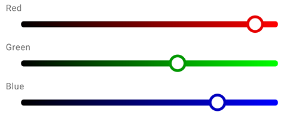
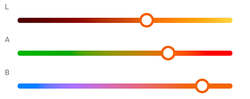
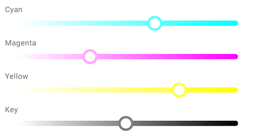

*:avocado: Handy, :snake: flexible and :zap: lightning-fast material color picking UI component for Android*

:speech_balloon: Work-In-Progress

## :pill: Features

- Clean, easy-to-use components and API
- High performance
- Material styling in mind
- Standard Android SDK view family
- Wide color models support
- Tooling and utilities
- Alpha channel support
- Cutting edge tech stack
- Active development and support

## :hammer: Setup

Gradle dependency:

```gradle
implementation "codes.side:andcolorpicker:0.2.0"
```

## :art: Picker types

### HSL (hue, saturation, lightness)

- *Add color model description*


#### Layout XML Snippet

Basic HSL components:
```xml
<codes.side.andcolorpicker.hsl.HSLColorPickerSeekBar
  android:id="@+id/hueColorPickerSeekBar"
  android:layout_width="match_parent"
  android:layout_height="wrap_content"
  app:hslColoringMode="pure"
  app:hslMode="hue" />
```

Supported `hslMode` values:
- `hue` (default)
- `saturation`
- `lightness`

Supported `hslColoringMode` values:
- `pure` (default)
- `output`

Alpha component:
```xml
<codes.side.andcolorpicker.alpha.HSLAlphaColorPickerSeekBar
  android:id="@+id/alphaColorPickerSeekBar"
  android:layout_width="match_parent"
  android:layout_height="wrap_content" />
```

#### Kotlin Snippet
```kotlin
// Configure picker color model programmatically
hueColorPickerSeekBar.mode = Mode.MODE_HUE // Mode.MODE_SATURATION, Mode.MODE_LIGHTNESS

// Configure coloring mode programmatically
hueColorPickerSeekBar.coloringMode = ColoringMode.PURE_COLOR // ColoringMode.OUTPUT_COLOR

// Group pickers with PickerGroup to automatically synchronize color across them
val pickerGroup = PickerGroup<IntegerHSLColor>().also {
  it.registerPickers(
    hueColorPickerSeekBar,
    saturationColorPickerSeekBar,
    lightnessColorPickerSeekBar,
    alphaColorPickerSeekBar
  )
}

// Get current color immediately
Log.d(
  TAG,
  "Current color is ${hueColorPickerSeekBar.pickedColor}"
)

// Listen individual pickers or groups for changes
pickerGroup.addListener(
  object : HSLColorPickerSeekBar.DefaultOnColorPickListener() {
    override fun onColorChanged(
      picker: ColorSeekBar<IntegerHSLColor>,
      color: IntegerHSLColor,
      value: Int
    ) {
      Log.d(
        TAG,
        "$color picked"
      )
      swatchView.setSwatchColor(
        color
      )
    }
  }
)

// Set desired color programmatically
pickerGroup.setColor(
  IntegerHSLColor().also {
    it.setFromColorInt(
      Color.rgb(
        28,
        84,
        187
      )
    )
  }
)

// Set color components programmatically
hueColorPickerSeekBar.progress = 50
```

### RGB (red, green, blue)



### LAB



#### Layout XML Snippet

Basic LAB components:
```xml
<codes.side.andcolorpicker.lab.LABColorPickerSeekBar
  android:id="@+id/lLABColorPickerSeekBar"
  android:layout_width="match_parent"
  android:layout_height="wrap_content"
  app:labMode="l" />
```

### CMYK (cyan, magenta, yellow, key)



#### Layout XML Snippet

Basic CMYK components:
```xml
<codes.side.andcolorpicker.cmyk.CMYKColorPickerSeekBar
  android:id="@+id/cyanCMYKColorPickerSeekBar"
  android:layout_width="match_parent"
  android:layout_height="wrap_content"
  app:cmykMode="cyan" />
```

Supported `cmykMode` values:
- `cyan` (default)
- `magenta`
- `yellow`
- `black`

Supported `cmykColoringMode` values:
- `pure` (default)
- `output`

### Swatches

SwatchView component:
```xml
<codes.side.andcolorpicker.view.swatch.SwatchView
  android:id="@+id/swatchView"
  android:layout_width="match_parent"
  android:layout_height="wrap_content" />
```

#### Kotlin Snippet:
```kotlin
swatchView.setSwatchPatternTint(
  Color.LTGRAY
)

swatchView.setSwatchColor(
  IntegerHSLColor().also {
    it.setFromColorInt(
      ColorUtils.setAlphaComponent(
        Color.MAGENTA,
        128
      )
    )
  }
)
```

## :rocket: Roadmap

- [ ] Add more picker types
    - [x] HLS SeekBars
    - [ ] RGB SeekBars
    - [ ] RGB circle
    - [ ] RGB plane
    - [ ] HSV/HSB seekbars
    - [x] CMYK SeekBars
    - [x] Alpha SeekBars
    - [ ] HSL (S+L) plane
    - [ ] LAB
    - [ ] XYZ
    - [ ] YPbPr
    - [x] Swatches
- [ ] Extend picker types
    - [ ] CMYK SeekBars coloring modes
    - [ ] More awesome swatches
    - [ ] More supported alpha color models
- [x] Sample buttons -> radios
- [x] Remove sample app child press delays
- [x] Enhance API
- [x] Add XML attributes
- [x] Provide *git-flow*
- [ ] Automate release/publish flow
- [x] Add thumb animation
- [x] Add *MaterialDrawer* & sample fragments
- [x] Add more *HSLColorPickerSeekBar* checks and reduce calls count
- [x] Add more encapsulation to limit picker modification capabilities
- [x] Package repository publish *(Bintray)*
- [ ] Add *Rx* support
- [x] Add/Revisit *RecyclerView* support
- [x] Add sample app icon
- [ ] Add logger solution
- [ ] Add sample app analytics
- [ ] Add GIFs media
- [ ] Add call flow diagram
- [ ] Add tests
- [ ] Add docs
- [ ] Add contribution guidelines
- [x] Add OSS licenses
- [x] Add license

## :memo: License

```
Copyright 2020 Illia Achour

Licensed under the Apache License, Version 2.0 (the "License");
you may not use this file except in compliance with the License.
You may obtain a copy of the License at

    http://www.apache.org/licenses/LICENSE-2.0

Unless required by applicable law or agreed to in writing, software
distributed under the License is distributed on an "AS IS" BASIS,
WITHOUT WARRANTIES OR CONDITIONS OF ANY KIND, either express or implied.
See the License for the specific language governing permissions and
limitations under the License.
```
