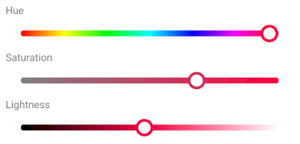
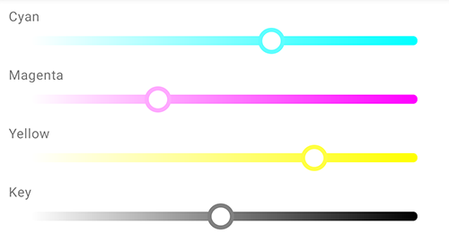

*:avocado: Handy, :snake: flexible and :zap: lightning-fast material color picking UI component for Android*

:speech_balloon: Work-In-Progress
## Roadmap

- [ ] Add more picker types
    - [x] HLS SeekBars
    - [ ] RGB SeekBars
    - [ ] RGB circle
    - [ ] RGB plane
    - [ ] CMYK SeekBars
    - [ ] Alpha SeekBars
    - [ ] HSL (S+L) plane
    - [ ] Swatches
- [x] Sample buttons -> radios
- [x] Remove sample app child press delays
- [ ] Enhance API
- [x] Add XML attributes
- [ ] Provide *git-flow*
- [ ] Automate release/publish flow
- [ ] Add thumb animation
- [x] Add *MaterialDrawer* & sample fragments
- [ ] Add more *HSLColorPickerSeekBar* checks and reduce calls count
- [ ] Add more encapsulation to limit picker modification capabilities
- [x] Package repository publish *(Bintray)*
- [ ] Add *Rx* support
- [x] Add/Revisit *RecyclerView* support
- [x] Add sample app icon
- [ ] Add logger solution
- [ ] Add sample app analytics
- [ ] Add GIFs media
- [ ] Add call flow diagram
- [ ] Add tests
- [ ] Add docs
- [ ] Add contribution guidelines
- [x] Add OSS licenses
- [x] Add license

## Setup

Gradle dependency:

```gradle
implementation "codes.side:andcolorpicker:0.1.0"
```

## Picker types

### HSL (hue, saturation, lightness)

- *Add color model description*



#### Layout XML Snippet
```xml
<codes.side.andcolorpicker.hsl.HSLColorPickerSeekBar
  android:id="@+id/hueColorPickerSeekBar"
  android:layout_width="match_parent"
  android:layout_height="wrap_content"
  app:hslColoringMode="pure"
  app:hslMode="hue" />

<codes.side.andcolorpicker.hsl.HSLColorPickerSeekBar
  android:id="@+id/saturationColorPickerSeekBar"
  android:layout_width="match_parent"
  android:layout_height="wrap_content"
  app:hslColoringMode="pure"
  app:hslMode="saturation" />

<codes.side.andcolorpicker.hsl.HSLColorPickerSeekBar
  android:id="@+id/lightnessColorPickerSeekBar"
  android:layout_width="match_parent"
  android:layout_height="wrap_content"
  app:hslColoringMode="pure"
  app:hslMode="lightness" />
```

### CMYK (cyan, magenta, yellow, key)



#### Layout XML Snippet
```xml
<codes.side.andcolorpicker.cmyk.CMYKColorPickerSeekBar
  android:id="@+id/cyanCMYKColorPickerSeekBar"
  android:layout_width="match_parent"
  android:layout_height="wrap_content"
  app:cmykMode="cyan" />
```

#### Kotlin Snippet
```kotlin
// Configure picker color model programmatically
hueColorPickerSeekBar.mode = Mode.MODE_HUE // Mode.MODE_SATURATION, Mode.MODE_LIGHTNESS

// Configure coloring mode programmatically
hueColorPickerSeekBar.coloringMode = ColoringMode.PURE_COLOR // ColoringMode.OUTPUT_COLOR

// Group pickers with PickerGroup to automatically synchronize color across them
val pickerGroup = PickerGroup<IntegerHSLColorModel>().also {
  it.registerPickers(
    hueColorPickerSeekBar,
    saturationColorPickerSeekBar,
    lightnessColorPickerSeekBar
  )
}

// Set desired color programmatically
pickerGroup.setColor(
  IntegerHSLColorModel().also {
    it.setFromColor(
      Color.rgb(
        28,
        84,
        187
      )
    )
  }
)

// Set color components programmatically
hueColorPickerSeekBar.progress = 50

// Get current color immediatly
Log.d(
  TAG,
  "Current color is ${hueColorPickerSeekBar.currentColor}"
)

// Listen for changes
hueColorPickerSeekBar.addListener(
  object : DefaultOnColorPickListener<IntegerHSLColorModel>() {
    override fun onColorChanged(
      picker: ColorSeekBar<IntegerHSLColorModel>,
      color: IntegerHSLColorModel,
      value: Int
    ) {
      Log.d(
        TAG,
        "$color picked"
      )
    }
  }
)
```

## License

```
Copyright 2020 Illia Achour

Licensed under the Apache License, Version 2.0 (the "License");
you may not use this file except in compliance with the License.
You may obtain a copy of the License at

    http://www.apache.org/licenses/LICENSE-2.0

Unless required by applicable law or agreed to in writing, software
distributed under the License is distributed on an "AS IS" BASIS,
WITHOUT WARRANTIES OR CONDITIONS OF ANY KIND, either express or implied.
See the License for the specific language governing permissions and
limitations under the License.
```
